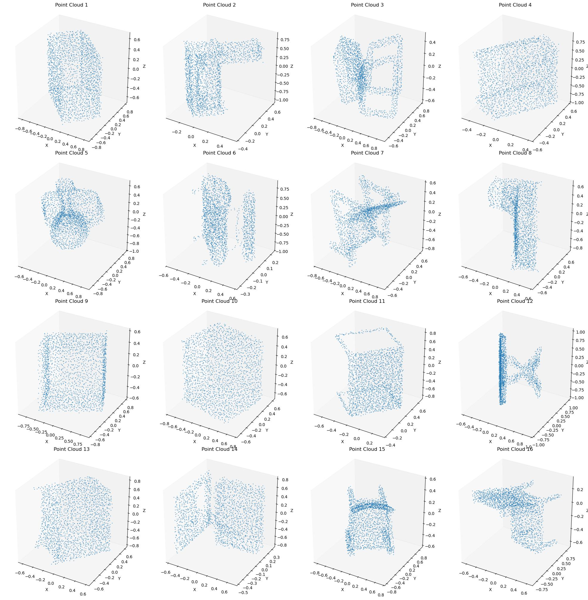

# 🌀 3D Shape Classification using PointNet

This project implements **3D point cloud classification** on the **ModelNet10 dataset** using a simplified version of the **PointNet architecture** in PyTorch.  

---

## 🎯 Objective
The goal of this project is to classify **3D shapes** (represented as point clouds) into one of the **10 object categories** in the ModelNet10 dataset.  
Example categories include: `chair`, `sofa`, `bathtub`, `bed`, etc.  

---

## 🛠️ Method
We implement a **PointNet-based classifier** that directly consumes point clouds without voxelization or mesh conversion.  

### Key Components:
- **Data Augmentation**: random rotation around z-axis, jittering, conversion to PyTorch tensors  
- **Model Architecture**: shared MLPs using `Conv1d`, max pooling for global feature extraction, fully connected layers with dropout & batch norm, final log-softmax for classification  
- **Training**: NLLLoss as criterion, Adam optimizer, evaluation via loss and accuracy  

---

## ⚙️ Setup & Running the Project

### 1. Clone this repository
```bash
git clone https://github.com/subratabiswas1/3d-shape-classification.git
cd 3d-shape-classification
````

---

## 📦 Installation

First, install the required dependencies:

```bash
pip install torch torchvision numpy matplotlib
```

---

## 🚀 Training & Evaluation

Since this project is provided as a **Jupyter Notebook (`.ipynb`)**, open the notebook and run it cell by cell:

```bash
jupyter notebook 3d_shape_classification.ipynb
```

This will:

* Train the PointNet classifier on the training set
* Print **training/validation losses & accuracies per epoch**
* Save the best model as `best_model.pth`
* Save a visualization of point clouds as `visualize.jpg`

---

## ✅ Results

* **Best model weights** → `best_model.pth`
* **Visualization of 3D point clouds** → `visualize.jpg`
* **Training/validation accuracy** printed during training

### 📌 Final Results (after 20 epochs)

```
Epoch 20/20
Train Loss: 2.1772, Train Acc: 0.4047
Val Loss: 1.6997, Val Acc: 0.7600
Saved best model!
Best validation accuracy: 0.7600
```

The model achieves **76% validation accuracy** on the ModelNet10 dataset. 🎉

---

## 📂 Project Structure

```
3d-shape-classification/
│── 3d_shape_classification.ipynb   # Main Jupyter Notebook
│── data/                           # ModelNet10 dataset (preprocessed .npy files)
│── best_model.pth                  # Saved best model (after training)
│── visualize.jpg                   # Example visualization of point clouds
│── README.md                       # Project documentation
```

---

## 🖼️ Visualization

Example visualization of a batch of 3D point clouds (`visualize.jpg`):



---

## 🌟 Future Improvements

* Implement **PointNet++** for local feature learning
* Enable **GPU/accelerator training** for faster training
* Extend experiments to **ModelNet40 dataset**

---

## 🏆 Credits

* **PointNet Paper**: Qi et al., CVPR 2017 — [https://arxiv.org/abs/1612.00593](https://arxiv.org/abs/1612.00593)
* **Dataset**: ModelNet10 — [https://modelnet.cs.princeton.edu/](https://modelnet.cs.princeton.edu/)
* **Implementation**: PyTorch

---
